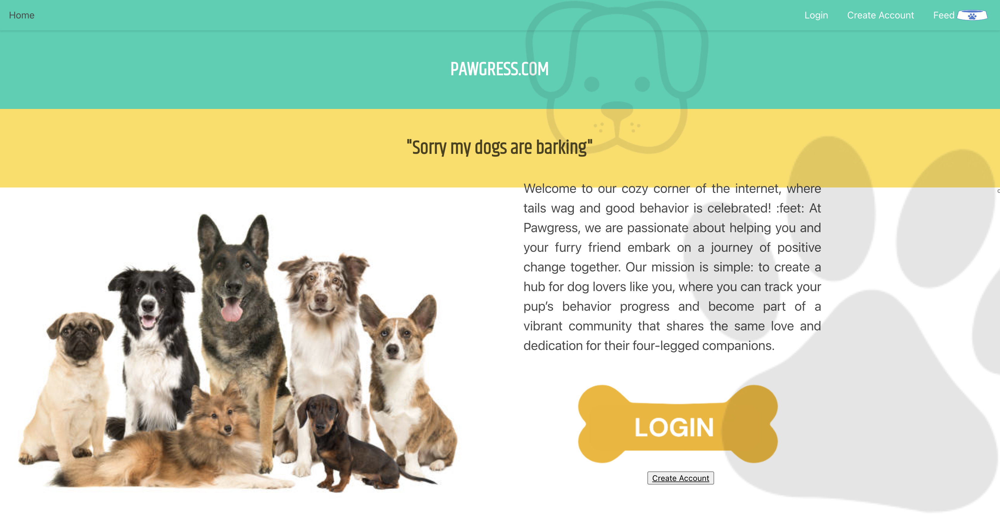
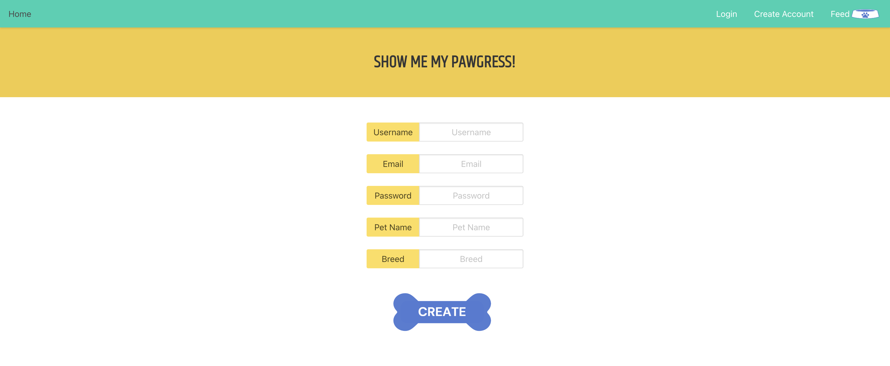
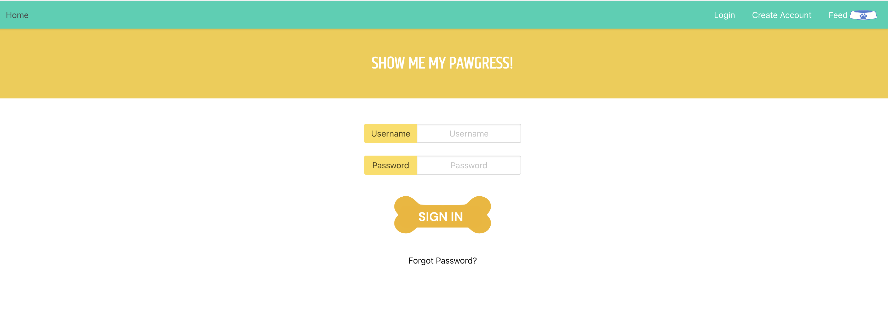
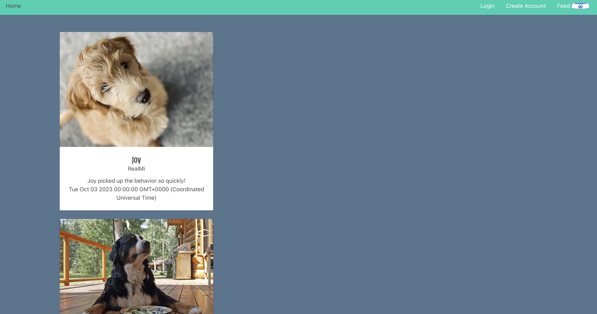

# PAWGRESS.com

## Description

PAWGRESS.com is a web application designed to assist individuals in promoting positive behavior in their dogs. This platform offers users the ability to create an account or log in to track and monitor their dogs' behavior over time. It serves as a comprehensive tool for dog owners who are committed to understanding, training, and enhancing their furry companions' behavior.

Many challenges were faced during this process given the learning curve toward the new technology. However, the team was able to further expand their critical thinking skills and hone in on prior knowledge and skills. 

## Key Features

### User Registration and Authentication

Account Creation:
New users can easily create an account by providing their basic information, such as name, email, and password. Account creation is a straightforward process to get started on their journey to improving their dog's behavior.

Login: 
Registered users can securely log in to access their accounts and manage their dog's behavior tracking data and access the community feed.

### Dog Behavior Tracking

Behavior Log:
Users can record and track their dog's behavior using a user-friendly interface. They can log various behaviors and receive paws as the behavior progresses. Users can also track multiple dogs with their behaviors. 

### Community and Support

Community Feed:
Users have access to a community feed where they can see other dog owners and their dog's progress. 

Future Development:
The platform aims to provide: resources, articles, and expert advice on dog training to help users achieve their goals effectively.

## Usage
You may access the website at the following URL:
https://pawgress-263620beafdd.herokuapp.com/

The pages will welcome you with the following images:

Home: 

Create Account:

Login:

Profile:

Feed: 

## Technologies Used

The Dog Behavior Tracker is built using the following technologies:

- **Frontend:** HTML, CSS, JavaScript
- **Backend:** Node.js, Express.js
- **Database:** MySQL, Sequelize

## Contributing
An essential aspect of successfully completing this project was the ability to collaborate effectively as a team. We would like to acknowledge the contributions of our teammates, Mia Olmedillo, Giselle Reyes, Annielys Sosa, and Marien Castellanos, who played a crucial role in achieving the project's objectives and meeting its acceptance criteria.
 
To supplement the design of the Portfolio, the following sites were utilized:
-Canva.com  
-Google Fonts for unique fonts.
-W3 Schools 
-MDN Web Docs 
-Bulma Layouts

## License

This project is licensed under the [MIT License](LICENSE).

---

Join us on this journey to foster positive behavior in our furry friends. Together, we can create a community of well-behaved dogs and happy dog owners.